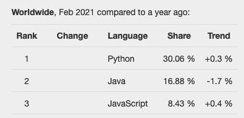
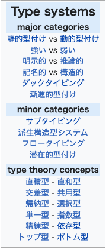
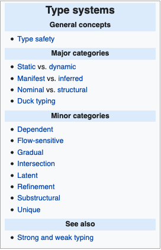

<!-- theme: gaia -->

# カタカタ型ターン！！

 こんな感じで終わりたかった話

---

<!-- _backgroundColor: aqua -->

## もくじ

- 編集後記
- 概要：型
- Java
- Python
- Typescript
- まとめ

---
<!-- Scoped style -->
<style scoped>
p {
  color: red;
  font-weight:bold;
}
</style>

# 編集後記

Java 型 わかる Go 型 わかる
Typescript 型 JSじゃ無いからギリわかる
Python Typing 型 はぁ？


---
<!-- Scoped style -->
<style scoped>
h1 {
  color: blue;
}
</style>

# slide 2

struct typing とは？ は禁句です

調べ終わっていない


---

<!-- Scoped style -->
<style scoped>
* {
  text-align:center;
  font-weight:bold;
}
p {
  font-size: 2em;
}
</style>


型さん
**申し訳ありませんでした**

---
<!-- Scoped style -->
<style scoped>
* {
  text-align:center;
  font-weight:bold;
}
p {
  font-size: 1em;
}
</style>

加えて


こういうタイプのプログラマは
今日の話オモロ無いです

---


---

# 概要

| | |
| - | - |
| [PYPL PopularitY of Programming Language](https://pypl.github.io/PYPL.html) |   |

ランキングTop３な言語を見てみると
うちで利用している言語とかぶるので
最近どうなのか？軽く見てみるか？

---

#### 概要 （そんな軽い気持ちだった）

型システムは考え方がたくさんあります
その中でも 共変と反変 を見ていきたいと思います

| JA| EN |
| - | - |
|  |  |


---


---

# 型

[共変性と反変性 (計算機科学)](https://ja.wikipedia.org/wiki/%E5%85%B1%E5%A4%89%E6%80%A7%E3%81%A8%E5%8F%8D%E5%A4%89%E6%80%A7_(%E8%A8%88%E7%AE%97%E6%A9%9F%E7%A7%91%E5%AD%A6))

>・共変 (covariant): 広い型（例：double）から狭い型（例：float）へ変換する(できる)こと。  
> ・反変 (contravariant): 狭い型（例：float）から広い型（例：double）へ変換する(できる)  こと。  
> ・不変 (invariant): 型を変換できないこと。  
> ・双変 (bivariant): 広い型にも狭い型にも変換できること。


---

# Java

---

# Python

---

# Typescript


---

## まとめ

* 不変
  - 参照、追加、更新、削除出来る
  - 幅は無い
* 共変
  - 参照に使える
  - 要素追加は、元の型の保障が出来んよになる
* 反変
  - 参照に使えない。typesafe で無くてもよければで使える
  - 要素追加は、なんでも入れれる（ほぼ）


---
<!-- Scoped style -->
<style scoped>
* {
  text-align:center;
  font-weight:bold;
}
p {
  font-size: 1em;
}
</style>


✨
Screenの前のあなた
共変とか反変とかどうでもいいよ
そんな気持ちかと思います

---
<!-- Scoped style -->
<style scoped>
* {
  text-align:center;
  font-weight:bold;
}
p {
  font-size: 1em;
}
</style>

# お土産になるか？わからない考察の話

Consitency の個人的な見解


[The Circle - why consistency is key](https://www.castlegreen.co.uk/blog/news/2019/9/the-circle-why-consistency-is-key.aspx)
フィットネスの話ぽいです（記事とは関係ありません）

---

# お土産になるか？わからない考察の話


Frontend ⇔ Backend

Developer Experience

```

   +------+             +-------+
   | Front|  <--type--> | Back  |  Communication
   +------+     safe    +-------+  Transport

   .-------.            .-------.
   | Ts    |  Signature |Py/Java|  Coding
   `-------'  Declare   `-------'  Linter
```

---

# お土産になるか？わからない考察の話


Service ⇔ Service

Service Building Experience


```
   +------+             +-------+
   |      |  <--type--> |       |
   +------+     sage    +-------+

   .-------.            .-------.
   | Ts    |CodingStyle |Py/Java|  Skill/Knowledge
   `-------'  Spirit    `-------'  Transfer

```

---

https://blog.magrathealabs.com/pythons-covariance-and-contravariance-b422c63f57ac

```python
def test_covarient() -> None:
    vb: VO = VO(True)
    vs: VS = VS("tst")
    vi: VI = VI(123)

    lst: List[VS] = [vs, vs, vi]
    print(lst)

    vlt: EList[VS] = EList(lst)
    vlt.print()
    vlt.extend([vs, vi])
    # vlt.extend([vb]) # mypy error but runnable
    vlt.print()

    assert vlt.at(0).value() == "tst"
    #data = [1,2,3] # mypy error
    #ns: EList[int] = EList(data)
    #ns.print()
```