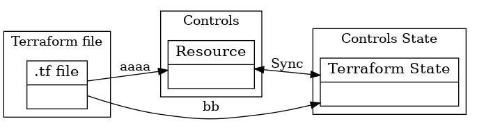

## preface


### for target

実際に Terraform を始める前に触ってみて、やる・やらを決めるたい層の方を対象にしています。
やることを決めている方は、入門書や公式サイトを参照ください


## intro


### What is terraform


全体像





```
  "--- tf file --------------------"
  | +-----------------------+      |
  | | Terraform & Provider  |      |
  | |    configuratin       |      |
  | +-----------------------+      |
  | +-----------------------+      |
  | |      Variable         |      |
  | +-----------------------+      |
  | +----------------------------+ |
  | |  Resource or Module        | |
  | | ,-----------.   +--------+ | |
  | | | Resource  |-.-| Input  | | |
  | | |           | | +--------+ | |
  | | `-----------' '-| Output | | |
  | |  `----------'   +--------+ | |
  | +----------------------------+ |
  "--------------------------------"
```

configuration


resource data


### flow

1. create tf file
2. check tf file
3. state import (or apply if already exists) 
4. plan
5. apply
6. destroy


|  Item 1 | Item 2   |
| ------- | -------- |
|  row1   | row 1    |


## Learn Terraform

### Hello world


#### using variable input output


#### build in local


## Module


## Workspace


## Advanced (road to Terraform introduction )


https://www.terraform.io/docs/extend/best-practices/index.html

### providers


https://registry.terraform.io/providers/hashicorp/null/latest

https://registry.terraform.io/providers/hashicorp/random/latest


https://registry.terraform.io/providers/hashicorp/local/latest


https://registry.terraform.io/providers/hashicorp/external/latest


## test

https://www.terraform.io/docs/extend/testing/index.html

https://zenn.dev/aquamarinearia/articles/terratest_testing_terrafom_code


### awesome

https://github.com/shuaibiyy/awesome-terraform


## epub

https://github.com/kmuto/review

https://github.com/takahashim/cheepub
